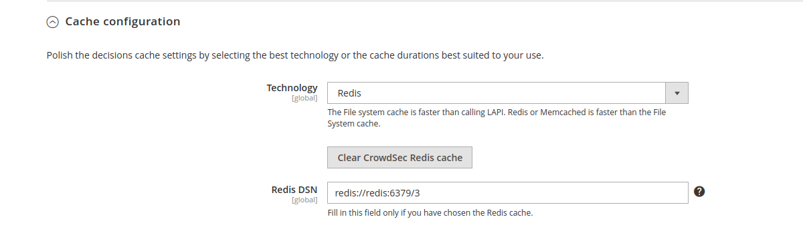

# CrowdSec Bouncer extension for Magento 2
----------------------------------------------

## User Guide

---------------------------------------------

### Description

The `CrowdSec_Bouncer` extension for Magento® 2 adds options to remove old customer cart items on login.

### Usage

#### Features

You should use this module if you want to disable the merge of abandoned cart and current cart when the customer logs in.

Indeed, Magento® 2 stores by default all customers cart contents and restores carts automatically at login. This may lead to 
confusion and have an impact conversion rates. This extension will clear all saved cart items at customer login depending on some 
configurations.

#### Configurations

This module comes with four configurations:

   

  * `Stores > Configuration > Sales > Checkout > Clear old cart on login > Enable feature` (`store view` scope)
  
  This configuration allows you to enable/disable the feature. If enabled, old cart items will be removed during login if there is a current cart. 
  This removal will depend on the following configurations too.
  
  * `Stores > Configuration > Sales > Checkout > Clear old cart on login > Enable debug log` (`store view` scope)
  
  This is only for debug purpose and should be disabled in a production environment. 
  If enabled, you will see some information in a `var/log/okaeli-clear-old-cart.log` file.
  
  * `Stores > Configuration > Sales > Checkout > Clear old cart on login > Remove old cart even in new one is empty` (`store view` scope)
  
  If enabled, old cart items will be removed on login even if the cart is empty before login. As a result, customer will
   have in this case an empty cart after login. If disabled, old cart will be kept on login if new one is empty.
  
  * `Stores > Configuration > Sales > Checkout > Clear old cart on login > Lifetime threshold (in days)` (`store view` scope)
  
  With this configuration, you can decide to remove old cart only if it has not been updated since X days. In other words: 
  if an old cart is too recent, it will not be removed on login. To disable this verification, let 0 in 
  the configuration field.
  

 
