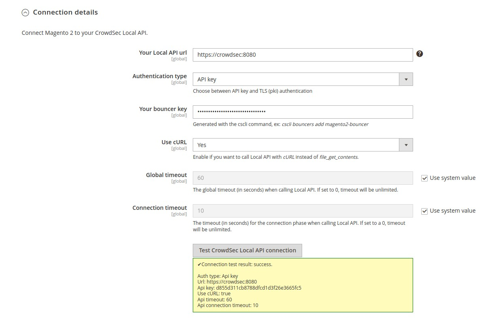
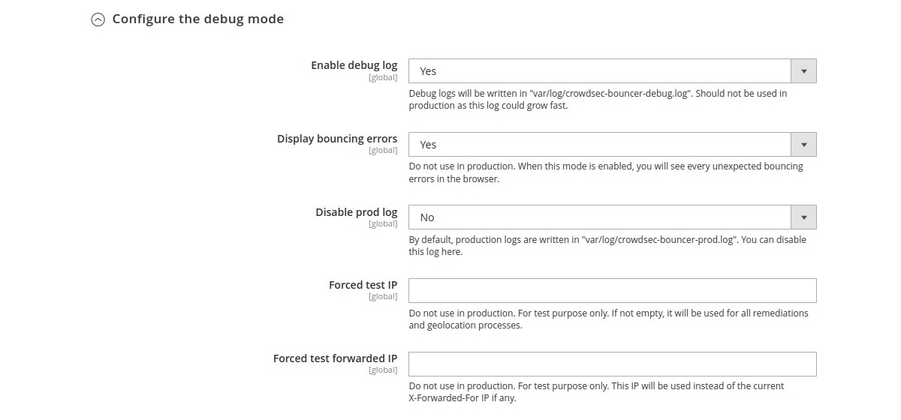

# CrowdSec Bouncer extension for Magento 2

## User Guide


<!-- START doctoc generated TOC please keep comment here to allow auto update -->
<!-- DON'T EDIT THIS SECTION, INSTEAD RE-RUN doctoc TO UPDATE -->
**Table of Contents**

- [Description](#description)
- [Prerequisites](#prerequisites)
- [Usage](#usage)
  - [Features](#features)
  - [Configurations](#configurations)
    - [General Settings](#general-settings)
    - [Theme customizations](#theme-customizations)
    - [Advanced settings](#advanced-settings)
  - [Auto Prepend File mode](#auto-prepend-file-mode)
    - [PHP](#php)
    - [Nginx](#nginx)
    - [Apache](#apache)

<!-- END doctoc generated TOC please keep comment here to allow auto update -->


## Description

The `CrowdSec Bouncer` extension for Magento 2 has been designed to protect Magento 2 websites from all kinds of attacks by using [CrowdSec](https://crowdsec.net/) technology.

## Prerequisites

To be able to use this bouncer, the first step is to install [CrowdSec v1](https://doc.crowdsec.net/docs/getting_started/install_crowdsec/).
CrowdSec is only in charge of the "detection", and won't block anything on its own. You need to deploy a bouncer to "apply" decisions.

Please note that first and foremost CrowdSec must be installed on a server that is accessible via the Magento 2 site.


## Usage

### Features

When a user is suspected by CrowdSec to be malevolent, this bouncer will either send him/her a captcha to resolve or 
simply a page notifying that access is denied. If the user is considered as a clean user, he will access the page as normal.

By default, the ban wall is displayed as below:


By default, the captcha wall is displayed as below:


Please note that it is possible to customize all the colors of these pages in a few clicks so that they integrate best with your design. 

On the other hand, all texts are also fully customizable. This will allow you, for example, to present translated pages in your users’ language.


### Configurations

This module comes with configurations that you will find under `Stores → Configurations → Security → CrowdSec Bouncer` admin section.

These configurations are divided in four main parts : `General Settings`, `Theme customizations`, `Advanced settings` and `Events`.


#### General Settings

  In the `General settings` part, you will set your connection details and refine bouncing according to your needs.
  


***

 `Connection details → Your LAPI Url` (`global` scope) 
 
Url to join your CrowdSec LAPI.
 
***
 
 `Connection details → Your bouncer key` (`global` scope)
 
Key generated by the cscli command.


**N.B** : Even before saving configuration, you can check if your settings are correct by clicking on the test button.

 ***


***

 `Bouncing → Enable bouncer on Frontend area` (`store view` scope) 
 
Choose which store views you want to protect.
 
***

 `Bouncing → Enable bouncer on Adminhtml area` (`global` scope) 
 
Choose if you want to protect admin too.
 
***

  `Bouncing → Enable bouncer on API areas` (`global` scope) 
  
Choose if you want to protect REST, SOAP and GraphQL endpoints.


**N.B** : For API calls, there will be no ban or captcha wall. User will receive a `401` (ban) or `403` (captcha) response code.

***

  `Bouncing → Bouncing level` (`store view` scope) 
  
Choose if you want to apply CrowdSec directives (Normal bouncing) or be more permissive (Flex bouncing).

With the `Flex mode`, it is impossible to accidentally block access to your site to people who don’t deserve it. This 
mode makes it possible to never ban an IP but only to offer a Captcha, in the worst-case scenario.
 
***


#### Theme customizations

 In the `Theme customizations` part, you can modify texts and colors of ban and captcha walls. All fields here are 
 store view scoped, so you can use different languages and designs.


####  Advanced settings


  In the `Advanced settings` part, you can enable/disable the stream mode, choose your cache system for your CrowdSec 
  LAPI, handle your remediation policy and adjust some debug and log parameters.


***

`Communication mode to the API → Enable the stream mode` (`global` scope)

Choose if you want to enable the `stream mode` or stay in `live mode`.


By default, the `live mode` is enabled. The first time a stranger connects to your website, this mode means that the IP will be checked directly by the CrowdSec API. The rest of your user’s browsing will be even more transparent thanks to the fully customizable cache system.

But you can also activate the `stream mode`. This mode allows you to constantly feed the bouncer with the malicious IP list via a background task (CRON), making it to be even faster when checking the IP of your visitors. Besides, if your site has a lot of unique visitors at the same time, this will not influence the traffic to the API of your CrowdSec instance.

***

`Communication mode to the API → Cron expression for cache refresh` (`global` scope)

With the stream mode, every decision is retrieved in an asynchronous way. Here you can define the frequency of this 
cache refresh.

**N.B** : There is also a refresh button if you want to refresh the cache manually.


***


***

`Cache configuration → Technology` (`global` scope)

Choose the cache technology that will use your CrowdSec LAPI.

The File system cache is faster than calling LAPI. Redis or Memcached is faster than the File System cache.

**N.B** : There are also a clear cache button fo all cache technologies and a prune cache button dedicated to the 
file system cache.

***

`Cache configuration → Cron expression for file system cache pruning` (`global` scope)

If you chose file system as cache technology, you can schedule here an automatic cache pruning cron task.

***


`Cache configuration → Redis DSN` (`global` scope)

Only if you choose Redis cache as technology. Example of DSN: redis://localhost:6379.

***


`Cache configuration → Memcached DSN` (`global` scope)

Only if you choose Memcached cache as technology. Example of DSN: memcached://localhost:11211.

***


`Cache configuration → Clean IPs cache duration` (`global` scope)

The duration between re-asking LAPI about an already checked clean IP.

Minimum 1 second.  Note that this setting can not be apply in stream mode.

***

`Cache configuration → Bad IPs cache duration` (`global` scope)

The duration between re-asking LAPI about an already checked bad IP.

Minimum 1 second.  Note that this setting can not be apply in stream mode.

***


***

`Remediations → Fallback to` (`global` scope)

Choose which remediation to apply when CrowdSec advises unhandled remediation.

***


`Remediations → Trust these CDN Ips` (`global` scope)

If you use a CDN, a reverse proxy or a load balancer, it is possible to indicate in the bouncer settings the IP ranges of these devices in order to be able to check the IP of your users. For other IPs, the bouncer will not trust the X-Forwarded-For header.

***

`Remediations → Hide CrowdSec mentions` (`global` scope)

Enable if you want to hide CrowdSec mentions on the Ban and Captcha walls.
***



***

`Configure the debug mode → Enable debug log` (`global` scope)

Enable if you want to see some debug information in a specific log file.

***

`Configure the debug mode → Display bouncings errors` (`global` scope)

When this mode is enabled, you will see every unexpected bouncing errors in the browser.

***

`Configure the debug mode → Disable prod log` (`global` scope)

The prod log is lighter than the debug log. But you can disable it here.

***

#### Events

In the `Events` part, you can enable and configure business events logging.

***

`Logging → Enable events log` (`global` scope)

If enabled, logs will be written in a `var/log/crowdsec-events.log` file.

***

`Logging → Hide sensitive data` (`global` scope)

If "Yes", sensitive data (email, ...) will be obfuscated as a sha256 hash string.

***


### Auto Prepend File mode

By default, this extension will bounce every web requests: e.g requests called from webroot `index.php`.
This implies that if another php public script is called (`cron.php` if accessible for example, or any of your 
custom public php script) bouncing will not be effective.
To ensure that any php script will be bounced if called from a browser, you should try the `auto prepend file` mode.

In this mode, every browser access to a php script will be bounced.

To enable the `auto prepend file` mode, you have to:

- copy the `crowdsec-prepend.php.example` file in your Magento 2 `app/etc` folder and rename it `crowdsec-prepend.php`
- configure your server by adding an `auto_prepend_file` directive for your php setup.

**N.B:**
- Beware that you have to copy the file before modifying your PHP configuration,or you will get a PHP fatal error.
- Note that if you upgrade the bouncer module, you should have to copy the file again. To make this copy
  automatically, you should modify the root `composer.json` of your Magento 2 projects by adding `post-install-cmd`
  and `post-update-cmd` to the scripts parts:

```
"scripts": {
    "post-install-cmd": [
        "php -r \"copy('vendor/crowdsec/magento2-module-bouncer/crowdsec-prepend.php.example','app/etc/crowdsec-prepend.php');\""
    ],
    "post-update-cmd": [
        "php -r \"copy('vendor/crowdsec/magento2-module-bouncer/crowdsec-prepend.php.example','app/etc/crowdsec-prepend.php');\""
    ]
}
```


Adding an `auto_prepend_file` directive can be done in different ways:

#### PHP

You should add this line to a `.ini` file :

    auto_prepend_file = /magento2-root-directory/app/etc/crowdsec-prepend.php


#### Nginx


If you are using Nginx, you should modify your Magento 2 nginx configuration file by adding a `fastcgi_param` 
directive. The php block should look like below:

```
location ~ \.php$ {
    ...
    ...
    ...
    fastcgi_param PHP_VALUE "/magento2-root-directory/app/etc/crowdsec-prepend.php";
}
```

#### Apache

If you are using Apache, you should add this line to your `.htaccess` file:

    php_value auto_prepend_file "/magento2-root-directory/app/etc/crowdsec-prepend.php"

 
